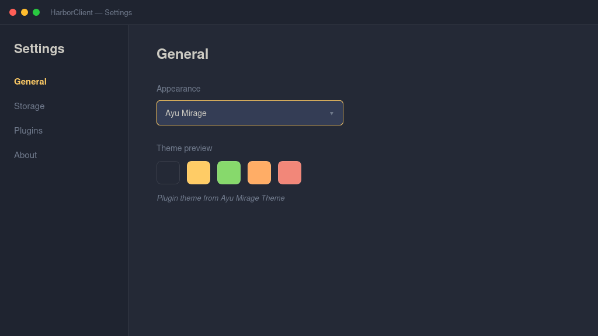

# Ayu Mirage Theme

Cool slate backgrounds with a warm gold accent and soft coral highlights — Ayu Mirage’s balanced, easy-on-the-eyes dark palette.



This is a JSON-only theme plugin: HarborClient loads the palette from
`exported.json` via `contributes.themes[].import`. No JavaScript entry or build
step is required.

## Permissions

- `ui` — theme registration

## Package layout

```
ayu-mirage/
├── manifest.json      # contributes.themes[].import → exported.json
├── exported.json      # harborclientExport: "theme" envelope
├── README.md
├── screenshot.png
└── signature.json     # publisher signature (from pnpm release)
```

If you later add a sibling CSS file and set `"stylesheet": "styles.css"` in the
export, HarborClient inlines that CSS into `exported.json` on first read so the
theme stays a single self-contained file.

## Usage

Enable the plugin, then choose **Ayu Mirage** from the Appearance dropdown.

Requires HarborClient `>=2.5.0` (theme JSON import).

## Development

1. In HarborClient, open **File → Themes** (or **Settings → Plugins**) → **Load unpacked…** and select this project folder
2. Enable the plugin and select **Ayu Mirage** under **View → Theme** or **Settings → General → Appearance**

Edit colors in `exported.json` and reload the unpacked plugin to preview changes. No `pnpm build` is needed.

## Packaging

```bash
pnpm pack
```

Creates `../ayu-mirage.hcp` with `manifest.json`, `exported.json`, `README.md`, `screenshot.png`, and `signature.json`.

To bump the version, resign, commit, and tag:

```bash
pnpm release
```
